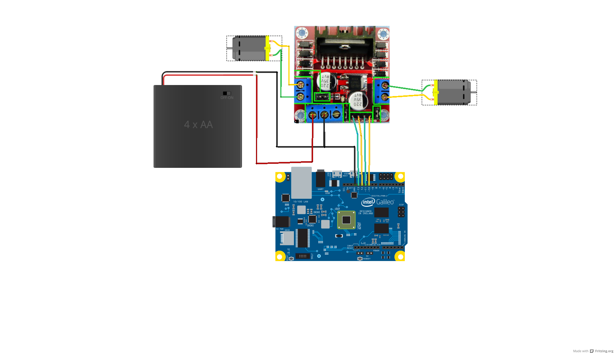

Windows Powered RC Car
===================
---------
Content
-------------

- [Components](#Components)
- [Hooking up Components](#hooking-up-components)
- [Run it!](#run-it!)
- [The Code](#the-code)
- [USB HID Controller Code](#usb-hid-controller-code)
- [Winsock UDP](#winsock-udp)

###Components
- Intel Galileo running Windows off an SD Card
- 5V DC Power Supply (either a wall-powered supply, or a battery pack like [this](http://www.adafruit.com/products/1566) one.)
- A L298N Motor Driver Board ( We've used [this](http://www.ebay.com/itm/like/131207525759?lpid=82) one )
- HID Compliant Controller/Gamepad (We've used an old NES Controller converted to be a HID Device, you can get one [here](http://www.thinkgeek.com/product/1b4c/)
- Microusb Male to USB Female Adapter Cable
- Ethernet Cable
- 4 AA Batteries (or as many batteries as your RC Car needs)
- An RC Car (We've used a Maisito Dune Rover) 
- Male-Female Breadboard Wires

Optional:
- Laptop running Windows & the Remote RC Car Control Application
- Xbox 360 controller for Windows

###Hooking Up Components

1. Carefully disassemble your purchased RC Car. Specifically, you want to remove the model chassis so you can get at the controller board.

2. You should be able to clearly see 4 wires (two for each motor, assuming a 2 motor RC Car), and 2 more wires from the battery pack, connected to a PCB which contains the controller for the RC Car.

3. Carefully snip away all the leads connected to that PCB. Make sure you know which wire is connected to what part of your RC Car. 

4. Remove the PCB, in it's place, put the L298N Motor Driver Board.

5. Wire up the motor driver board as follows:
>- Connect the +'ve and -'ve leads of one motor to "Output 1" and "Output 2" of the L298N board.
>- Similarily, connect the +'ve and -'ve leads of the other motor to "Output 3" and "Output 4" of the L298N Board.
>- Connect the Battery Pack ground line to the ground input of the L298N Board.
>- Connect the Ground output of the Galileo to the L298N Board Ground input (we want to tie together the grounds of the Galileo and the RC Car)
>- Connect the Battery Pack power line to the +12V input of the L298N Board (don't worry if your battery pack puts out less than 12V)
>- Connect Galileo GPIO pins 13,12,11,10 to Inputs 1-4 of the L298N Board 

**Note: Depending on how you've wired everything up, you may need to play around with the order that you connect these wires to have the controls inverted/regular. In any case, the first motor will be controlled by the inputs 1 and 2, and the second by 3 and 4. To turn on a motor, one of each pair should be high (+5V) and the other low (0V). The motor's direction may be the opposite of what you expect depending on how you've wired it up.

Finally, using the USB adapter cable, plug the NES Controller into the Galileo's USB Host port, and power on the Galileo (make sure the RC Car is turned off until the Galileo is completely booted up and the controller application is running).

###Run it!
Using Visual Studio or Telnet, deploy and run the eCar application. This application runs two threads, one waiting for commands over UDP from a host machine, and the other waiting for local commands from a HID Controller. When commands are received, it drives the GPIO outputs which should drive the motors through the L298N board. 

Once the application has started running on the Galileo, turn on the RC Car and try driving it with the NES controller. With any luck, it should be working just fine! If not, check your wiring as discussed in the Note above.

If you're also using the network-control companion application, you can press "Select" on the NES controller to switch the control mode from local control, to remote from a PC control.

###The Code

There are several files in this project, the purpose of each is listed below.

- Main.cpp
- Controller.cpp and .h
- Communicator.cpp and .h
- Command.h
- nesmapping.h
- stdafx.h

**_Main_**
- The main function that initializes the Galileo pins, and listens to UDP and HID commands to drive the RC Car

**_Controller_**
- Wraps the HID Device communication to talk to the NES Controller

**_Communicator_**
- Wraps the UDP communication done using Winsock

**_Command_**
- An enum representing different commands for the RC Car, used to translate UDP commands

**_nesmapping_**
- Holds the mappings between the NES buttons and their HID identifiers

**_stdafx_**
- Houses all of the external includes for the project

###USB HID Controller Code
Using Windows on Devices gives you access to rich software features that just aren't available on other, similar platforms. One example is full USB support, and several class drivers that are built into the operating system.

For this project, we've used a HID Compliant Gamepad device to drive the input of the RC Car. Take a look at 

**_Controller.h_** and **_Controller.cpp_** to see how to access a HID Device. **_nesmapping.h_** contains the mappings between the HID value and button identifiers with the physical buttons. These need to be determined either from your device's datasheet, or experimentally by writing a program that outputs the button value (see getButtonInput in Controller.cpp for how to read button usages). 

In general, reading from a HID device has XXX main steps, in brackets is the function and line number in which  this step is performed in **_Controller.cpp_**.

1. Get the HID GUID (used by the OS to identify HID devices) [ registerController : 64 ]
2. Get device interface details and iterate through each device until the HID device you're looking for is found. [registerController: 71-93]
3. Create a handle to the HID Device, in the OS this is treated as a file handle [registerController : 94]
4. Get the Preparsed Data for the HID Device, an abstracted data structure that can be used [registerController : 109]
5. Get the Device Capabilities, and from that get the Button and Value Capabilities. These describe the buttons and inputs on the device. For the NES controller, the Values represent the up-down and left-right movement of the DPAD and the Buttons the 4 buttons of the controller. [registerController : 132-141]  
6.  Get an input report by reading from the file [getDpadInput : 213]
7.  Interpret the usage values to get information about the state of the controller [getDpadInput : 234-262]
8.  For button input, repeat steps 6-7 for buttons [getButtonInput]
9. Don't forget to free your allocated data structures.

See MSDN for more documentation, available [here](http://msdn.microsoft.com/en-us/library/windows/hardware/ff538865(v=vs.85).aspx).

###Winsock UDP

With Windows on Devices, it's easy to send simple communications over a network or the internet, using UDP or TCP and the winsock API. For this project, we've used winsock to allow for secondary control over the RC car by UDP packets sent from another computer, anywhere on the network the Galileo is connected to. 

See **_Communicator.h_** and **_Communicator.cpp_** to see how we've used winsock & UDP.

You can also read the documentation on MSDN for more information, available [here](TODO)